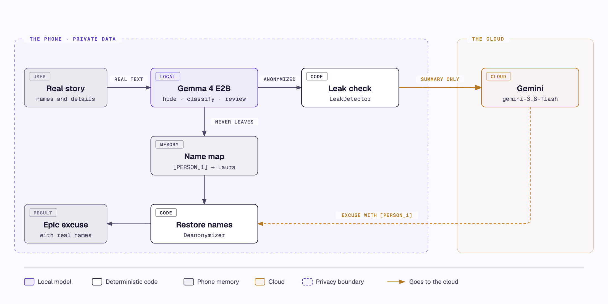
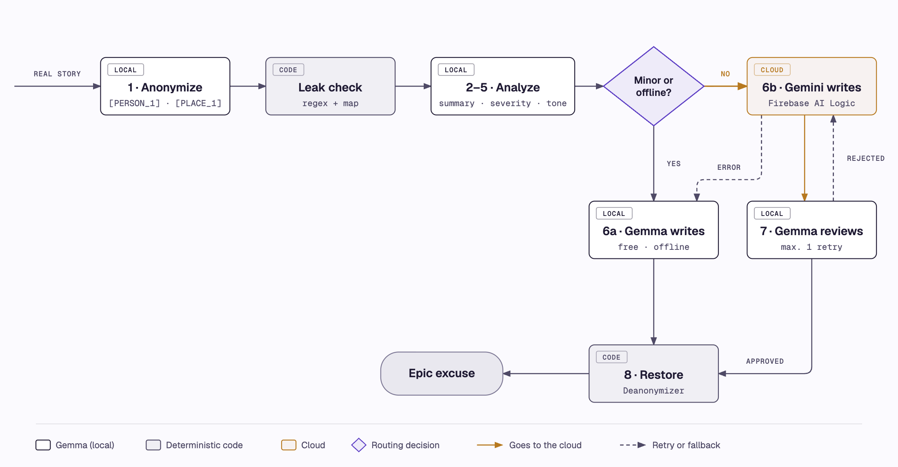
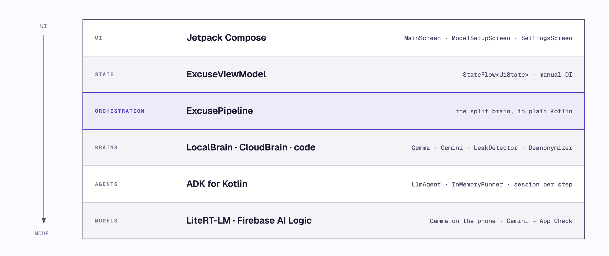

# Excusa Legendaria — a split-brain Android app

[Leer en español](README.md)

You tell the app the real, embarrassing reason you were late or missed something ("I overslept binge-watching series and missed the meeting with my boss Laura at Oficinas Norte"). It gives you back an **epic** excuse, ready to send.

The real goal of the project is to show the **split brain** architecture.

UI text is in Spanish (`res/values/strings.xml`). Code, prompts and docs are in English.

## Split brain in a nutshell

**What it is.** An AI app splits the work between a small model on the device and a big one in the cloud, each doing what it does best, and leaves to code whatever can't afford mistakes. In distributed systems, *split brain* means something else (a cluster that splits in two, with each half making contradictory decisions); here it is used in the AI-apps sense.

**Vocabulary.** To *anonymize* is to replace names, places and dates with *placeholders* like `[PERSON_1]`. The map that says `[PERSON_1]` is Laura stays on the phone. A *leak* is a real value that slips into what goes to the cloud.

**The three brains.** There are three kinds of work, and each has different properties:

| Brain | Understands language | Makes mistakes | Cost | Offline | Your data |
| --- | --- | --- | --- | --- | --- |
| **Code** | No | No, if written correctly | Free and instant | Yes | Stays |
| **Local model** (Gemma) | Yes, on short tasks | Sometimes | Free, but slow on CPU | Yes | Stays |
| **Cloud model** (Gemini) | Yes, the best | Less | Paid per call | No | Leaves |

The usual definition of split brain talks about two: device and cloud. Counting code as a third brain forces it to own responsibilities (detecting leaks, choosing the route, counting words, restoring names) instead of being the glue between the models. That way, whatever can't afford mistakes never depends on a model.

**Why split.**

| Reason | In this app |
| --- | --- |
| **Privacy** | The real story never leaves the phone. Gemini only receives the anonymized story, summarized when it is long. |
| **Cost** | Minor situations are solved on-device, without calling the API. |
| **Quality** | Gemini writes the creative excuse when it is worth it, and the local model reviews it. |
| **Availability** | Without internet the app still works, using only the local model. |
| **Latency** | Whatever a rule can solve waits for no model, and without real internet the app doesn't even try to call Gemini. |

**How to decide what goes where.** For each step, three questions, in this order:

1. **Can a rule solve it?** Counting, comparing, matching a pattern or deciding with data you already have. Then it's code: free, instant and testable with certainty.
2. **Does it touch sensitive data, or is it classifying, extracting or reviewing?** Then the local model. These are short, focused tasks, exactly where a small model does well.
3. **Does it need creativity, broad knowledge or long reasoning?** Then the cloud, with the local model as a fallback when there is no connection or the call fails.

When a step hits both 2 and 3, like writing the excuse (the story is private, but the excuse needs creativity), the way out is to **anonymize first**: the local model removes the sensitive data, the step stops being sensitive and can go to the cloud. And since the cloud costs money, it is only used when it is worth it: here, the severity of the situation decides. The decision about which data crosses to the cloud lives in code, with tests.

**When it doesn't pay off.** The local model is a 2.6 GB download and needs memory; without a GPU it runs on the CPU and is slow; two models are two ways to fail, each with its fallback and tests; and not every phone can run it. If your data isn't sensitive, your app is always online and API cost doesn't worry you, a single cloud model is probably enough.

**The pieces.**

- **Gemma 4 E2B:** Google's open model for phones, with about 2B *effective* parameters. It ships as a 2.6 GB `.litertlm` file.
- **LiteRT-LM:** Google's runtime that runs the model on the phone, on CPU or GPU.
- **Firebase AI Logic:** Firebase's SDK to call Gemini from the app, with no backend of your own. App Check protects it.
- **ADK for Kotlin:** Google's agent framework. An agent (`LlmAgent`) is a model plus an instruction, and ADK runs it the same way whether the model lives on the phone or in the cloud.

## What it looks like


---

## 1. Architecture





| Step | Brain | Why there |
| --- | --- | --- |
| 1. Anonymize | Local | The real story must never leave the phone |
| Leak check | Code | If Gemma forgot a name or a value, it is fixed before leaving |
| 2. Summarize | Local | Fewer tokens sent = lower cost and less exposure |
| 3. Severity | Local | Decides whether paying for the API is worth it |
| 4. Style | Local | Simple classification, ideal for a small model |
| 5. Prompt building | Local + code | Code picks a random story theme and fills the template; the model suggests an approach |
| 6a. Generate (minor / offline) | Local | Free and works offline |
| 6b. Generate (moderate / severe) | Gemini (cloud) | Better creativity and coherence |
| 7. Review | Local (+ code for the word limit) | Quality control at no extra cost |
| 8. De-anonymize | Code | Exact replacement, no hallucinations |

### The layers



ADK lets an orchestrator agent, that is, a model, decide which steps to run. It isn't used here: the order of the steps, the routing and the retries are ordinary `if`/`when` in Kotlin, so the decision about what may leave the phone stays explicit, deterministic and testable.

### Heuristics: when a rule is enough

Not everything local is a model. These rules do work that a model would do worse, slower or without guarantees. Split brain is not only about privacy: it is also deciding what does not need a model at all.

| Rule | Where | What it solves |
| --- | --- | --- |
| If the story has fewer than 60 words, it is not summarized | `ExcusePipeline.kt` | One less Gemma call: less waiting, nothing lost |
| Minor, offline or failed anonymization: Gemma writes | `ExcusePipeline.kt` | What leaves the phone and when paying for the API is worth it |
| Regex for e-mails, phone numbers and long numbers | `LeakDetector.kt` | Data with a recognizable shape, without relying on the model |
| More than 120 words: excuse rejected | `ExcusePipeline.kt` | Small models can't count words |
| Random theme, never the same as last time | `ExcusePipeline.kt`, `themes.txt` | Variety: ADK 1.1.0 doesn't pass temperature, the parameter that controls how varied the answer is, to Gemma |
| Invalid JSON: one retry, then a default value | `ExcusePipeline.kt`, `JsonParsing.kt` | A malformed answer doesn't break the pipeline |
| Emulator, or a GPU that crashed the app before: CPU is used | `GemmaLocalBrain.kt` | Avoids a native crash no `try/catch` can catch |
| Network not validated by Android: Gemini isn't even tried | `Connectivity.kt` | No waiting for a timeout when there is no real internet |
| Unknown placeholder at the end: a generic word ("alguien") | `Deanonymizer.kt` | The user never sees a `[PERSON_3]` |

---

## 2. Where you can see the split brain

### In the code

Everything happens in [`ExcusePipeline.kt`](app/src/main/java/com/example/legendaryexcuse/pipeline/ExcusePipeline.kt). Each step is wrapped in `step(StepId.X, Brain.LOCAL | CLOUD | CODE) { ... }`, so every step states which brain runs it. The key lines:

```kotlin
// 6. Routing: THIS is the split-brain decision.
val wantsCloud = when (routing) {
  RoutingMode.FORCE_LOCAL -> false
  RoutingMode.FORCE_CLOUD -> true
  RoutingMode.AUTO -> analysis.severity != Severity.MINOR   // Gemma classifies severity; code decides the route
}
// Never send anything to the cloud if anonymization failed, and don't try without internet.
val useCloud = wantsCloud && isOnline && !anonymizationFailed
```

- `LeakDetector.check(...)` runs **before** anything can reach the cloud. It replaces real names the model forgot, plus e-mails, phone numbers and long numbers.
- `generateInCloud(...)` shows Gemini writing and Gemma reviewing, with one retry that includes the reviewer's reason.
- If Gemini fails (network error, timeout, App Check, quota), the pipeline catches it and **falls back to Gemma**.
- `Deanonymizer.restore(...)` puts the real names back **on the phone**, after the cloud is done.

### How each step fails

Every model step can fail, and which way it fails is a design decision: where privacy is at stake, it fails safe; where only quality is at stake, it fails permissive.

| If this fails… | What the pipeline does | Why |
| --- | --- | --- |
| Anonymize | Doesn't call the cloud: Gemma writes on the phone | Without the names hidden, nothing may leave |
| Severity | Assumes `moderate`, so it goes to the cloud | You lose on cost, not on privacy |
| Style | Context `other`, tone `dramatic` | An excuse in another tone still works |
| Approach | Stays empty and the template goes on | The random theme already gives a direction |
| Review | Approves the excuse | Only quality is at stake, and it beats an endless loop |
| Gemini (network, timeout, App Check or quota) | Gemma writes on the phone | The person always gets their excuse |

### Other rules the code keeps

- **Everything that crosses to the cloud comes from the anonymized text.** The local steps, the reviewer and the template work with placeholders; the real names only come back at the end. That is why the reason Gemma gives for rejecting an excuse can be sent to Gemini on the retry without leaking anything.
- **The local model returns data, not decisions.** It answers in JSON, and code turns it into fixed values (`Severity`, `Tone`) with `JsonParsing.enumOrNull`. Code decides with those values.
- **There is a record of what left.** The pipeline stores every text sent to the cloud, retry included, in `textSentToCloud`, and the tests assert on it (for example, that it doesn't contain "Laura").
- **A timeout is not a cancellation.** `withTimeout(20_000)` throws `TimeoutCancellationException`, which in Kotlin is a kind of `CancellationException`. `runCatchingCloud` catches the timeout to fall back to Gemma, but lets a real cancellation (the Cancel button) through. A plain `runCatching` would swallow both.

  ```kotlin
  private suspend fun <T> runCatchingCloud(block: suspend () -> T): Result<T> = try {
    Result.success(block())
  } catch (e: TimeoutCancellationException) {
    Result.failure(e)   // timeout: fall back to Gemma
  } catch (e: CancellationException) {
    throw e             // the user cancelled: stop
  } catch (e: Exception) {
    Result.failure(e)
  }
  ```

### In the app

- **While it works**, a progress card says which brain is busy: `Gemma oculta los nombres en tu teléfono…`, `Verificando que nada privado se escape…`, `Gemini escribe tu leyenda en la nube…`, `Gemma revisa la excusa de Gemini…`. When Gemma writes locally, you see the text stream in.
- **The result** carries a badge: `Escrita en tu teléfono por Gemma` or `Escrita en la nube por Gemini`.
- **Try it:**
  - The `Leve` example stays 100% on the phone.
  - The `Grave` example goes to Gemini.
  - Turn on airplane mode and `Grave` is written by Gemma, with the notice `Sin conexión`.
  - In Configuración you can force the local model or Gemini.

---

## 3. How to call the local model (Gemma on the phone)

[`GemmaLocalBrain.kt`](app/src/main/java/com/example/legendaryexcuse/brains/GemmaLocalBrain.kt): open **one** LiteRT-LM engine, wrap it as an ADK model, and give it to an `LlmAgent`.

```kotlin
// 1. Load Gemma 4 E2B (.litertlm) once, off the main thread. CPU here; on a real phone the app tries Backend.GPU() first.
val engine = Engine(EngineConfig(modelPath = modelFile.absolutePath, backend = Backend.CPU(), cacheDir = cacheDir.absolutePath))
engine.initialize()

// 2. Wrap it as an ADK model. Every local agent shares this ONE instance.
val gemma = LiteRtLmModel.create(engine, name = "gemma")

// 3. One agent per step, each with its own instruction.
val summarizer = LlmAgent(
  name = "local_summarize",
  model = gemma,
  instruction = Instruction("You summarize stories without losing key facts. Reply only with JSON."),
)

// 4. Run it: a fresh InMemoryRunner + new session per call, so steps never share context.
val json: String = summarizer.ask(prompts.fill("summarize", mapOf("anonymized_text" to text)))
```

`ask` / `runText` live in [`ExcuseAgents.kt`](app/src/main/java/com/example/legendaryexcuse/agents/ExcuseAgents.kt):

```kotlin
fun LlmAgent.runText(input: String, streaming: Boolean = false): Flow<String> = flow {
  val runner = InMemoryRunner(agent = this@runText, appName = "legendary_excuse")
  runner.runAsync(
    userId = "user",
    sessionId = UUID.randomUUID().toString(),                      // new session per step
    newMessage = Content.fromText(Role.USER, input),
    runConfig = RunConfig(streamingMode = if (streaming) StreamingMode.SSE else StreamingMode.NONE),
  ).collect { event ->
    if (event.author != name) return@collect
    when {
      streaming && event.partial -> emit(event.contentText())      // streamed chunks (local generation)
      !streaming && event.isFinalResponse -> emit(event.contentText())
    }
  }
}
```

LiteRT-LM generation blocks the thread, so `GemmaLocalBrain` runs it on `Dispatchers.IO`.

## 4. How to call the API (Gemini in the cloud)

[`GeminiCloudBrain.kt`](app/src/main/java/com/example/legendaryexcuse/brains/GeminiCloudBrain.kt): the same ADK `LlmAgent`, backed by the Firebase extension. **The app contains no Gemini API key.** Firebase AI Logic makes the call, and App Check proves the request comes from your real app.

```kotlin
import com.google.adk.firebase.models.Firebase as AdkFirebase   // alias: clashes with com.google.firebase.Firebase

const val GEMINI_MODEL = "gemini-3.8-flash"

val writer = LlmAgent(
  name = "cloud_writer",
  model = AdkFirebase.create(GEMINI_MODEL, FirebaseAI.getInstance(FirebaseApp.getInstance())), // Gemini Developer API backend
  instruction = Instruction("You write short, epic excuses in Spanish that never reveal the real reason."),
  generateContentConfig = GenerateContentConfig(
    temperature = 0.9f,
    maxOutputTokens = 1024,                                              // thinking tokens count against this
    thinkingConfig = ThinkingConfig(thinkingLevel = ThinkingLevel.LOW),  // gemini-3.8-flash rejects MINIMAL
  ),
)

suspend fun generate(prompt: String): String = withTimeout(20_000) { writer.ask(prompt) }
```

App Check is installed once in [`LegendaryExcuseApp.kt`](app/src/main/java/com/example/legendaryexcuse/LegendaryExcuseApp.kt):

```kotlin
Firebase.initialize(this)
if (BuildConfig.DEBUG) Firebase.appCheck.installAppCheckProviderFactory(DebugAppCheckProviderFactory.getInstance())
```

Notice that the local call and the cloud call look the same: **same ADK agent API, same prompt, different `model`**. That is the point of the split brain. Where the work runs is a routing decision in `ExcusePipeline`, not a different code path.

---

## 5. Privacy: what leaves the phone

- **Leaves the phone:** only the filled `base_template.txt`. It contains the anonymized story (summarized when long) with placeholders (`[PERSON_1]`, `[PLACE_1]`), plus context, severity, tone, approach and theme. Nothing else.
- **Never leaves the phone:** the original story and the placeholder → real value map. They live only in memory: they are never written to disk and never logged.
- **When nothing is sent:** if anonymization fails, the pipeline refuses to call the cloud and generates locally.
- **Unit tests enforce this:** `severeStoryGoesToGeminiWithoutRealNames`, `failedAnonymizationNeverReachesTheCloud` and `leakIsFixedByCodeBeforeLeavingThePhone`.

### Example: what Gemini receives

With the severe story, this is what the person writes. It never leaves the phone:

```text
Me quedé dormido viendo series hasta las 4 am y no llegué a la junta con mi jefa Laura en Oficinas Norte.
```

And this is what Gemini receives. The story is short, so it is not summarized: the situation is the anonymized story. Gemma writes the approach and code picks the theme at random, so those two lines change on every run:

```text
You are the world's greatest expert in legendary excuses.
Write ONE epic excuse in Spanish for the following situation.

Situation (the embarrassing truth, NEVER reveal it): Me quedé dormido viendo series hasta las 4 am y no llegué a la junta con mi jefa [PERSON_1] en [PLACE_1].
Context: work
Severity: severe
Tone: formal
Suggested approach: Present the absence as the result of rescuing a stranger in danger on the way to the meeting.
Theme of the invented story: a heroic rescue of a stranger or an animal

Rules:
[... the template's fixed rules ...]
```

The map that says `[PERSON_1]` is Laura stays on the phone.

### The leak detector

The small model makes mistakes, so its anonymization is never accepted without checking it. [`LeakDetector.kt`](app/src/main/java/com/example/legendaryexcuse/pipeline/LeakDetector.kt) is plain code, no model, and runs after Gemma anonymizes and **before** any text can leave the phone. It does two checks:

1. **Real values Gemma forgot to replace.** It uses the same map Gemma returned: if a real value is still in the text, it swaps it for its placeholder. It only replaces whole words; otherwise a short name like "Ana" would match inside "mañana". The typical case is a name that appears twice and the model replaced only one:

   ```text
   Gemma returns:      "No llegué a la junta con mi jefa Laura en [PLACE_1]"
                       map: [PERSON_1] → Laura, [PLACE_1] → Oficinas Norte
   The detector sends: "No llegué a la junta con mi jefa [PERSON_1] en [PLACE_1]"
   ```

2. **Data with a recognizable shape.** These don't depend on the model: they are found with regular expressions.

   ```kotlin
   private val patterns = listOf(
     Regex("""[\w.+-]+@[\w-]+\.[\w.]+"""), // e-mail
     Regex("""\+?\d[\d\s-]{6,}\d"""), // phone number
     Regex("""\d{6,}"""), // long number (ids, accounts)
   )
   ```

   Each match is replaced by a new placeholder (`[DATA_1]`, `[DATA_2]`) that is added to the map, so it is restored at the end too.

If the detector changed anything, the step is marked as fixed by code. The test `leakIsFixedByCodeBeforeLeavingThePhone` simulates exactly the slip in the example.

**Its limit:** the detector only finds what it already knows to look for. If Gemma never recognizes "Laura" as a person, "Laura" never enters the map and no regex catches it, because a name has no recognizable shape the way an e-mail does. The detector **reduces** the risk, it does not remove it. That is why there are several layers: the model detects, the code verifies, and the cloud only receives the anonymized version, summarized when it is long.

## 6. Prompts

All prompts are plain text in [`app/src/main/assets/prompts/`](app/src/main/assets/prompts), with `{{variables}}`, so you can edit them without touching code:

| File | Purpose |
| --- | --- |
| `anonymize.txt`, `summarize.txt`, `severity.txt`, `style.txt`, `approach.txt`, `review.txt` | Local steps, JSON-only answers |
| `base_template.txt` | Excuse generation. Identical for Gemma and Gemini, so you can compare them |
| `correction.txt` | Added on the retry after a rejected review |
| `themes.txt` | Story themes. Code picks one at random per run (never the previous one), so the same story gets a different excuse every time |

Lessons baked into the pipeline:

- **One task per call.** Small models fail less with focused tasks.
- **Parse defensively.** Every JSON answer is parsed with `kotlinx.serialization`. On invalid JSON the step retries once, then falls back to a default (`JsonParsing.kt`).
- **Count with code.** Small models can't count words, so code checks the 120-word review limit.

---

## 7. Project structure

```
app/src/main/
├── assets/prompts/*.txt              prompts + themes
├── res/values/strings.xml            ALL user-facing text (Spanish)
└── java/com/example/legendaryexcuse/
    ├── MainActivity.kt               single activity; navigation is a `when`
    ├── LegendaryExcuseApp.kt         Firebase + App Check
    ├── agents/ExcuseAgents.kt        one ADK LlmAgent per step + runText/ask helpers
    ├── brains/                       LocalBrain / CloudBrain interfaces + Gemma / Gemini implementations
    ├── pipeline/                     ExcusePipeline (orchestration) + code-brain utilities
    ├── model/                        Types.kt (domain), ModelDownloader.kt
    ├── util/Connectivity.kt          NetworkCallback → StateFlow<Boolean>
    └── ui/                           ViewModel + Compose screens
app/src/test/                         unit tests with fake brains (no Android, no models)
```

## 8. Setup

**Requirements:** JDK 17, Android SDK with platform 37 (ADK 1.1.0 needs `compileSdk 37`), and a device or emulator with at least 4 GB free storage and ideally 8 GB of RAM. The emulator runs Gemma on the CPU: slow, but fine for development.

### Firebase

1. Create (or reuse) a Firebase project and register an Android app with package `com.example.legendaryexcuse`, then download its config:
   ```bash
   firebase apps:create android "Excusa Legendaria" --package-name com.example.legendaryexcuse --project <PROJECT_ID>
   firebase apps:sdkconfig ANDROID <APP_ID> --project <PROJECT_ID> -o app/google-services.json
   ```
   `google-services.json` is gitignored. It includes the Firebase project API key. That key identifies the project; it is **not** a Gemini key. Gemini access is protected by App Check.
2. In the Firebase console, enable **Firebase AI Logic** with the **Gemini Developer API**, and enable **App Check** (enforce it for AI Logic).
3. **Debug token:** a debug build prints an App Check debug token in logcat (tag `DebugAppCheckProvider`). Register it once per device or emulator, in the console (App Check → Apps → ⋮ → Manage debug tokens) or via REST:
   ```bash
   curl -X POST -H "Authorization: Bearer $(gcloud auth print-access-token)" \
     -H "x-goog-user-project: <PROJECT_ID>" -H "Content-Type: application/json" \
     "https://firebaseappcheck.googleapis.com/v1/projects/<PROJECT_ID>/apps/<APP_ID>/debugTokens" \
     -d '{"displayName":"my emulator","token":"<TOKEN_FROM_LOGCAT>"}'
   ```
   Release builds would use Play Integrity; publishing is out of scope.

### The local model (Gemma 4 E2B, 2.6 GB)

On first launch the app downloads it from
`https://huggingface.co/litert-community/gemma-4-E2B-it-litert-lm/resolve/main/gemma-4-E2B-it.litertlm`
(Apache 2.0, not gated) into `filesDir/models/`. You can cancel and resume the download.

**Faster for development:** download it once on your computer and stream it into the app with `adb`. Streaming avoids needing twice the space on the device.

```bash
curl -L -o gemma-4-E2B-it.litertlm https://huggingface.co/litert-community/gemma-4-E2B-it-litert-lm/resolve/main/gemma-4-E2B-it.litertlm
./gradlew installDebug
adb shell run-as com.example.legendaryexcuse mkdir -p files/models
cat gemma-4-E2B-it.litertlm | adb shell "run-as com.example.legendaryexcuse sh -c 'cat > files/models/gemma-4-E2B-it.litertlm'"
```

If the file is already there with the right size, the app skips the download.

### Run

```bash
./gradlew testDebugUnitTest     # 32 unit tests: pipeline with fake brains, leak detector, de-anonymizer, prompts, JSON
./gradlew installDebug
```

**Emulator tip:** if the emulator shows Wi-Fi with a "!" and the cloud always falls back ("Sin conexión"), its DNS is broken. Start it with `emulator -avd <name> -dns-server 8.8.8.8`.

