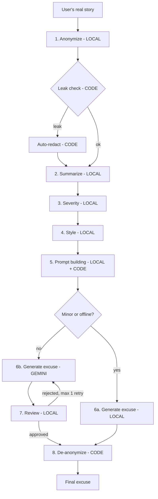

# Excusa Legendaria — a split-brain Android app

[Leer en español](README.md)

You tell the app the real, embarrassing reason you were late or missed something ("I overslept binge-watching series and missed the meeting with my boss Laura at Oficinas Norte"). It gives you back an **epic** excuse, ready to send.

The real goal of the project is to show the **split brain** architecture: a **small model on the phone** (Gemma 4 E2B via LiteRT-LM) and a **big model in the cloud** (Gemini via Firebase AI Logic) split the work. Plain **deterministic code** handles the parts that must be 100% reliable. The app orchestrates both models with **ADK for Kotlin**.

| Why split? | How |
| --- | --- |
| **Privacy** | The real story never leaves the phone. Gemini only receives an anonymized summary. |
| **Cost** | Minor situations are solved on-device, without calling the API. |
| **Quality** | Gemini writes the creative excuse when it is worth it, and the local model reviews it. |
| **Availability** | Without internet the app still works, using only the local model. |

UI text is in Spanish (`res/values/strings.xml`). Code, prompts and docs are in English.

---

## 1. Architecture



| Step | Brain | Why there |
| --- | --- | --- |
| 1. Anonymize | 📱 Local | The real story must never leave the phone |
| Leak check | ⚙️ Code | Never trust the small model blindly |
| 2. Summarize | 📱 Local | Fewer tokens sent = lower cost and less exposure |
| 3. Severity | 📱 Local | Decides whether paying for the API is worth it |
| 4. Style | 📱 Local | Simple classification, ideal for a small model |
| 5. Prompt building | 📱 Local + ⚙️ Code | Code picks a random story theme and fills the template; the model suggests an approach |
| 6a. Generate (minor / offline) | 📱 Local | Free and works offline |
| 6b. Generate (moderate / severe) | ☁️ Gemini | Better creativity and coherence |
| 7. Review | 📱 Local (+ ⚙️ code for the word limit) | Quality control at no extra cost |
| 8. De-anonymize | ⚙️ Code | Exact replacement, no hallucinations |

### The layers

```
UI (Compose)          ui/MainScreen.kt, ModelSetupScreen.kt, SettingsScreen.kt
      │ StateFlow<UiState>
ViewModel             ui/ExcuseViewModel.kt          wires everything (manual DI, no Hilt)
      │
Orchestration         pipeline/ExcusePipeline.kt     ← THE split brain, plain Kotlin
      │          │            │
LocalBrain   CloudBrain   Code brain
(Gemma)      (Gemini)     LeakDetector.kt, Deanonymizer.kt, PromptLoader.kt, JsonParsing.kt
      │          │
ADK for Kotlin: one LlmAgent per step (agents/ExcuseAgents.kt), InMemoryRunner, new session per call
      │          │
LiteRT-LM     Firebase AI Logic (+ App Check)
```

The orchestration is **not** an agent. The order of the steps, the routing and the retries are ordinary `if`/`when` in Kotlin, so the decision about what may leave the phone stays explicit, deterministic and testable.

---

## 2. Where you can see the split brain

### In the code

Everything happens in [`ExcusePipeline.kt`](app/src/main/java/com/example/legendaryexcuse/pipeline/ExcusePipeline.kt). Each step is wrapped in `step(StepId.X, Brain.LOCAL | CLOUD | CODE) { ... }`, so every step states which brain runs it. The key lines:

```kotlin
// 6. Routing: THIS is the split-brain decision.
val wantsCloud = when (routing) {
  RoutingMode.FORCE_LOCAL -> false
  RoutingMode.FORCE_CLOUD -> true
  RoutingMode.AUTO -> analysis.severity != Severity.MINOR   // Gemma decides if Gemini is worth paying for
}
// Never send anything to the cloud if anonymization failed, and don't try without internet.
val useCloud = wantsCloud && isOnline && !anonymizationFailed
```

- `LeakDetector.check(...)` (⚙️) runs **before** anything can reach the cloud. It replaces real names the model forgot, plus e-mails, phone numbers and long numbers.
- `generateInCloud(...)` shows Gemini writing and Gemma reviewing, with one retry that includes the reviewer's reason.
- If Gemini fails (network error, timeout, App Check, quota), the pipeline catches it and **falls back to Gemma**.
- `Deanonymizer.restore(...)` (⚙️) puts the real names back **on the phone**, after the cloud is done.

### In the app

- **While it works**, a progress card says which brain is busy: `📱 Ocultando nombres en tu teléfono…`, `⚙️ Verificando que nada privado se escape…`, `☁️ Gemini está escribiendo tu leyenda…`, `📱 Gemma revisa la excusa de Gemini…`. When Gemma writes locally, you see the text stream in.
- **The result** carries a badge: `📱 Escrita en tu teléfono por Gemma` or `☁️ Escrita en la nube por Gemini`.
- **Try it:**
  - The `Leve` example stays 100% on the phone.
  - The `Grave` example goes to Gemini.
  - Turn on airplane mode and `Grave` is written by Gemma, with the notice `Sin conexión`.
  - In ⚙️ Configuración you can force the local model or Gemini.

---

## 3. How to call the local model (Gemma on the phone)

[`GemmaLocalBrain.kt`](app/src/main/java/com/example/legendaryexcuse/brains/GemmaLocalBrain.kt): open **one** LiteRT-LM engine, wrap it as an ADK model, and give it to an `LlmAgent`.

```kotlin
// 1. Load Gemma 4 E2B (.litertlm) once. GPU first, CPU as fallback. Slow: do it off the main thread.
val engine = Engine(EngineConfig(modelPath = modelFile.absolutePath, backend = Backend.CPU(), cacheDir = cacheDir.absolutePath))
engine.initialize()

// 2. Wrap it as an ADK model. Every local agent shares this ONE instance.
val gemma = LiteRtLmModel.create(engine, name = "gemma")

// 3. One agent per step, each with its own instruction.
val summarizer = LlmAgent(
  name = "local_summarize",
  model = gemma,
  instruction = Instruction("You summarize stories without losing key facts. Reply only with JSON."),
)

// 4. Run it: a fresh InMemoryRunner + new session per call, so steps never share context.
val json: String = summarizer.ask(prompts.fill("summarize", mapOf("anonymized_text" to text)))
```

`ask` / `runText` live in [`ExcuseAgents.kt`](app/src/main/java/com/example/legendaryexcuse/agents/ExcuseAgents.kt):

```kotlin
fun LlmAgent.runText(input: String, streaming: Boolean = false): Flow<String> = flow {
  val runner = InMemoryRunner(agent = this@runText, appName = "legendary_excuse")
  runner.runAsync(
    userId = "user",
    sessionId = UUID.randomUUID().toString(),                      // new session per step
    newMessage = Content.fromText(Role.USER, input),
    runConfig = RunConfig(streamingMode = if (streaming) StreamingMode.SSE else StreamingMode.NONE),
  ).collect { event ->
    if (event.author != name) return@collect
    when {
      streaming && event.partial -> emit(event.contentText())      // streamed chunks (local generation)
      !streaming && event.isFinalResponse -> emit(event.contentText())
    }
  }
}
```

LiteRT-LM generation blocks the thread, so `GemmaLocalBrain` runs it on `Dispatchers.IO`.

## 4. How to call the API (Gemini in the cloud)

[`GeminiCloudBrain.kt`](app/src/main/java/com/example/legendaryexcuse/brains/GeminiCloudBrain.kt): the same ADK `LlmAgent`, backed by the Firebase extension. **The app contains no Gemini API key.** Firebase AI Logic makes the call, and App Check proves the request comes from your real app.

```kotlin
import com.google.adk.firebase.models.Firebase as AdkFirebase   // alias: clashes with com.google.firebase.Firebase

const val GEMINI_MODEL = "gemini-3.8-flash"

val writer = LlmAgent(
  name = "cloud_writer",
  model = AdkFirebase.create(GEMINI_MODEL, FirebaseAI.getInstance(FirebaseApp.getInstance())), // Gemini Developer API backend
  instruction = Instruction("You write short, epic excuses in Spanish that never reveal the real reason."),
  generateContentConfig = GenerateContentConfig(
    temperature = 0.9f,
    maxOutputTokens = 1024,                                              // thinking tokens count against this
    thinkingConfig = ThinkingConfig(thinkingLevel = ThinkingLevel.LOW),  // gemini-3.8-flash rejects MINIMAL
  ),
)

suspend fun generate(prompt: String): String = withTimeout(20_000) { writer.ask(prompt) }
```

App Check is installed once in [`LegendaryExcuseApp.kt`](app/src/main/java/com/example/legendaryexcuse/LegendaryExcuseApp.kt):

```kotlin
Firebase.initialize(this)
if (BuildConfig.DEBUG) Firebase.appCheck.installAppCheckProviderFactory(DebugAppCheckProviderFactory.getInstance())
```

Notice that the local call and the cloud call look the same: **same ADK agent API, same prompt, different `model`**. That is the point of the split brain. Where the work runs is a routing decision in `ExcusePipeline`, not a different code path.

---

## 5. Privacy: what leaves the phone

- **Leaves the phone:** only the filled `base_template.txt`. It contains the anonymized summary with placeholders (`[PERSON_1]`, `[PLACE_1]`), plus context, severity, tone, approach and theme. Nothing else.
- **Never leaves the phone:** the original story and the placeholder → real value map. They live only in memory: they are never written to disk and never logged.
- **When nothing is sent:** if anonymization fails, the pipeline refuses to call the cloud and generates locally.
- **Unit tests enforce this:** `severeStoryGoesToGeminiWithoutRealNames`, `failedAnonymizationNeverReachesTheCloud` and `leakIsFixedByCodeBeforeLeavingThePhone`.

## 6. Prompts

All prompts are plain text in [`app/src/main/assets/prompts/`](app/src/main/assets/prompts), with `{{variables}}`, so you can edit them without touching code:

| File | Purpose |
| --- | --- |
| `anonymize.txt`, `summarize.txt`, `severity.txt`, `style.txt`, `approach.txt`, `review.txt` | Local steps, JSON-only answers |
| `base_template.txt` | Excuse generation. Identical for Gemma and Gemini, so you can compare them |
| `correction.txt` | Added on the retry after a rejected review |
| `themes.txt` | Story themes. Code picks one at random per run (never the previous one), so the same story gets a different excuse every time |

Lessons baked into the pipeline:

- **One task per call.** Small models fail less with focused tasks.
- **Parse defensively.** Every JSON answer is parsed with `kotlinx.serialization`. On invalid JSON the step retries once, then falls back to a default (`JsonParsing.kt`).
- **Count with code.** Small models can't count words, so code checks the 120-word review limit.

---

## 7. Project structure

```
app/src/main/
├── assets/prompts/*.txt              prompts + themes
├── res/values/strings.xml            ALL user-facing text (Spanish)
└── java/com/example/legendaryexcuse/
    ├── MainActivity.kt               single activity; navigation is a `when`
    ├── LegendaryExcuseApp.kt         Firebase + App Check
    ├── agents/ExcuseAgents.kt        one ADK LlmAgent per step + runText/ask helpers
    ├── brains/                       LocalBrain / CloudBrain interfaces + Gemma / Gemini implementations
    ├── pipeline/                     ExcusePipeline (orchestration) + code-brain utilities
    ├── model/                        Types.kt (domain), ModelDownloader.kt
    ├── util/Connectivity.kt          NetworkCallback → StateFlow<Boolean>
    └── ui/                           ViewModel + Compose screens
app/src/test/                         unit tests with fake brains (no Android, no models)
```

## 8. Setup

**Requirements:** JDK 17, Android SDK with platform 37 (ADK 1.1.0 needs `compileSdk 37`), and a device or emulator with at least 4 GB free storage and ideally 8 GB of RAM. The emulator runs Gemma on the CPU: slow, but fine for development.

### Firebase

1. Create (or reuse) a Firebase project and register an Android app with package `com.example.legendaryexcuse`, then download its config:
   ```bash
   firebase apps:create android "Excusa Legendaria" --package-name com.example.legendaryexcuse --project <PROJECT_ID>
   firebase apps:sdkconfig ANDROID <APP_ID> --project <PROJECT_ID> -o app/google-services.json
   ```
   `google-services.json` is gitignored. It includes the Firebase project API key. That key identifies the project; it is **not** a Gemini key. Gemini access is protected by App Check.
2. In the Firebase console, enable **Firebase AI Logic** with the **Gemini Developer API**, and enable **App Check** (enforce it for AI Logic).
3. **Debug token:** a debug build prints an App Check debug token in logcat (tag `DebugAppCheckProvider`). Register it once per device or emulator, in the console (App Check → Apps → ⋮ → Manage debug tokens) or via REST:
   ```bash
   curl -X POST -H "Authorization: Bearer $(gcloud auth print-access-token)" \
     -H "x-goog-user-project: <PROJECT_ID>" -H "Content-Type: application/json" \
     "https://firebaseappcheck.googleapis.com/v1/projects/<PROJECT_ID>/apps/<APP_ID>/debugTokens" \
     -d '{"displayName":"my emulator","token":"<TOKEN_FROM_LOGCAT>"}'
   ```
   Release builds would use Play Integrity; publishing is out of scope.

### The local model (Gemma 4 E2B, 2.6 GB)

On first launch the app downloads it from
`https://huggingface.co/litert-community/gemma-4-E2B-it-litert-lm/resolve/main/gemma-4-E2B-it.litertlm`
(Apache 2.0, not gated) into `filesDir/models/`. You can cancel and resume the download.

**Faster for development:** download it once on your computer and stream it into the app with `adb`. Streaming avoids needing twice the space on the device.

```bash
curl -L -o gemma-4-E2B-it.litertlm https://huggingface.co/litert-community/gemma-4-E2B-it-litert-lm/resolve/main/gemma-4-E2B-it.litertlm
./gradlew installDebug
adb shell run-as com.example.legendaryexcuse mkdir -p files/models
cat gemma-4-E2B-it.litertlm | adb shell "run-as com.example.legendaryexcuse sh -c 'cat > files/models/gemma-4-E2B-it.litertlm'"
```

If the file is already there with the right size, the app skips the download.

### Run

```bash
./gradlew testDebugUnitTest     # 31 unit tests: pipeline with fake brains, leak detector, de-anonymizer, prompts, JSON
./gradlew installDebug
```

**Emulator tip:** if the emulator shows Wi-Fi with a "!" and the cloud always falls back ("Sin conexión"), its DNS is broken. Start it with `emulator -avd <name> -dns-server 8.8.8.8`.

## 9. Notes and deviations from the original spec

- **ADK 1.1.0** instead of 1.0.0 (latest release). No KSP processor, because no tools are used.
- **On-device temperature:** ADK does not forward `temperature` to LiteRT-LM, so the spec's 0.2 / 0.8 can't be applied to Gemma. Variety comes from the random `themes.txt` pick instead.
- **Gemini config:** `gemini-3.8-flash` does not accept thinking level `MINIMAL`, so it uses `LOW` with a 1024-token output budget.
- **GPU vs CPU:** GPU init on the emulator kills the process natively, which no `try/catch` can stop. The app therefore uses the CPU on emulators. On devices it leaves a marker file while trying the GPU and switches to the CPU on the next launch if the GPU crashed. The active backend is shown in Configuración.
- **Simplifications:** settings are kept in memory (no DataStore), the download uses a plain coroutine (no WorkManager), and navigation is a `when` (no navigation library).
- **UI:** the technical timeline and the "what did the cloud see" panel from the spec were left out of the UI to keep it simple. The pipeline still reports every step (brain, status, duration, output) to the ViewModel, and the unit tests check what is sent to the cloud.
