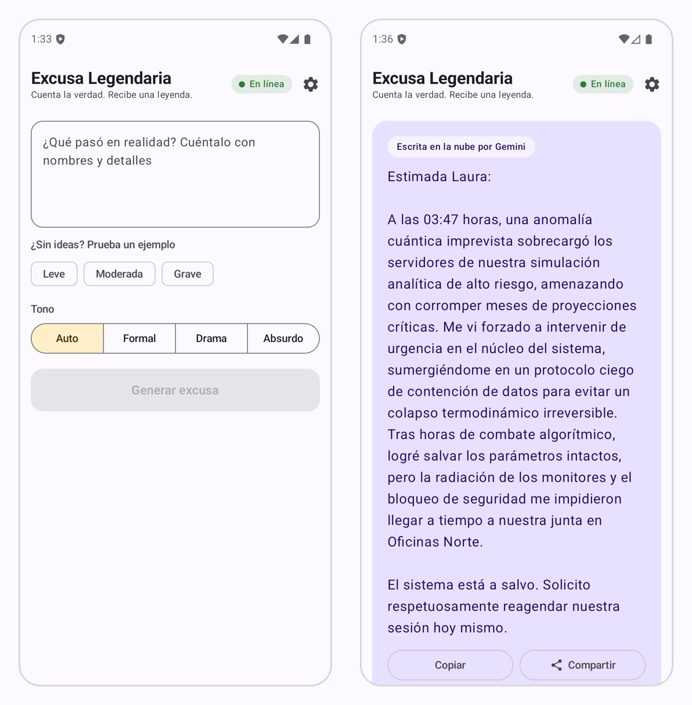
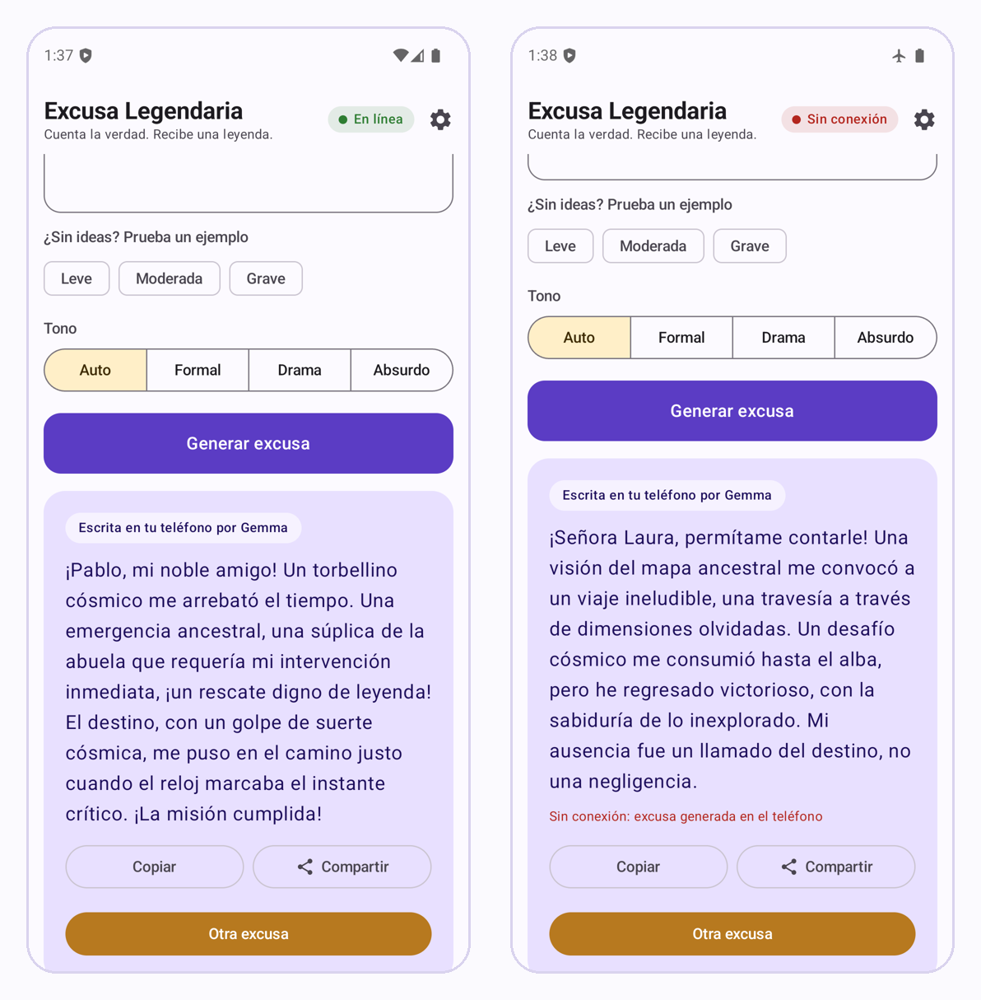
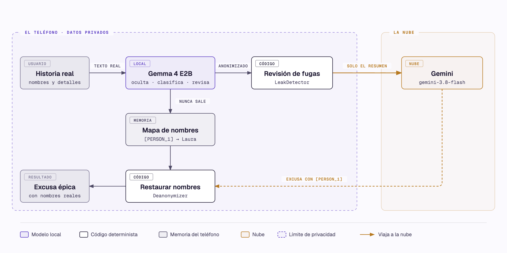
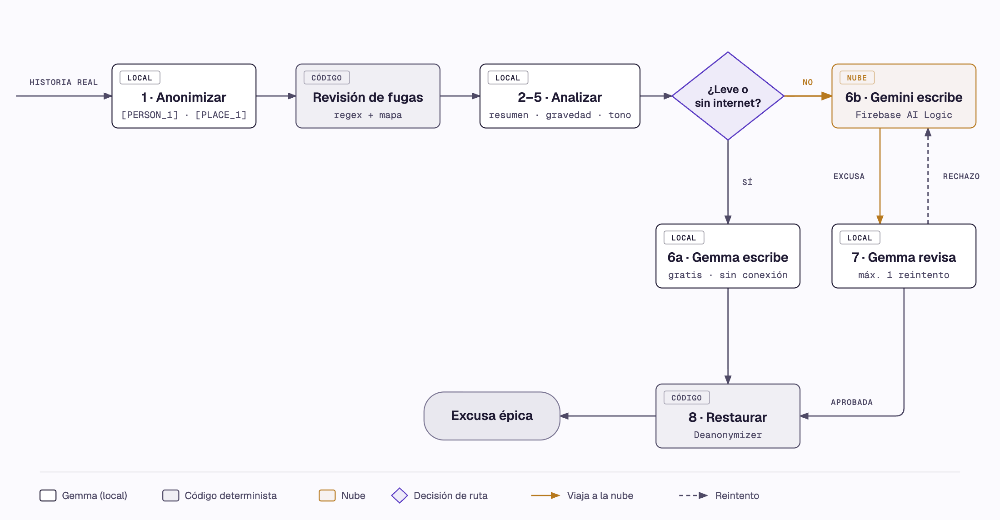
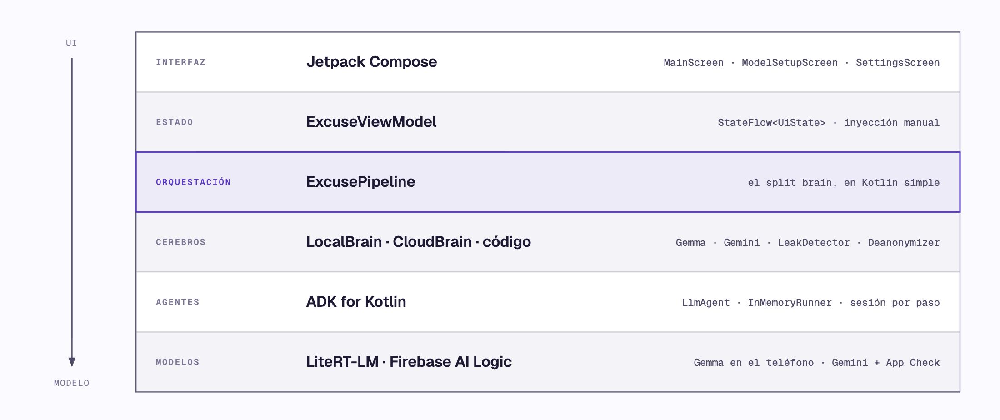

# Excusa Legendaria — una app Android con arquitectura *split brain*

[Read in English](README.en.md)

Le cuentas a la app la razón real (y vergonzosa) por la que llegaste tarde o faltaste. Por ejemplo: "me quedé dormido viendo series y no llegué a la junta con mi jefa Laura en Oficinas Norte". La app te devuelve una excusa **épica** y lista para enviar.

El objetivo real del proyecto es demostrar la arquitectura **split brain** ("cerebro dividido"). Un **modelo pequeño en el teléfono** (Gemma 4 E2B con LiteRT-LM) y un **modelo grande en la nube** (Gemini con Firebase AI Logic) se reparten el trabajo. El **código determinista** se encarga de lo que tiene que ser 100% confiable. Los dos modelos se orquestan con **ADK for Kotlin**.

| ¿Por qué dividir? | Cómo |
| --- | --- |
| **Privacidad** | La historia real nunca sale del teléfono. A Gemini solo llega un resumen anonimizado. |
| **Costo** | Los casos leves se resuelven en el teléfono, sin llamar a la API. |
| **Calidad** | Gemini escribe la excusa creativa cuando vale la pena, y el modelo local la revisa. |
| **Disponibilidad** | Sin internet la app sigue funcionando, solo con el modelo local. |

La interfaz está en español (`res/values/strings.xml`). El código, los prompts y los comentarios están en inglés.

## Así se ve





---

## 1. Arquitectura





| Paso | Cerebro | Por qué ahí |
| --- | --- | --- |
| 1. Anonimizar | Local | La historia real nunca debe salir del teléfono |
| Revisión de fugas | Código | No se confía ciegamente en el modelo pequeño |
| 2. Resumir | Local | Menos tokens enviados = menor costo y menor exposición |
| 3. Gravedad | Local | Decide si vale la pena pagar la API |
| 4. Estilo | Local | Clasificación simple, ideal para un modelo chico |
| 5. Construir prompt | Local + código | El código elige un tema al azar y llena la plantilla; el modelo sugiere la estrategia |
| 6a. Generar (leve / sin internet) | Local | Gratis y sin conexión |
| 6b. Generar (moderada / grave) | Gemini (nube) | Mejor creatividad y coherencia |
| 7. Revisión | Local (+ código para el límite de palabras) | Control de calidad sin costo extra |
| 8. Restaurar nombres | Código | Reemplazo exacto, sin riesgo de alucinación |

### Las capas



La orquestación **no** es un agente. El orden de los pasos, el enrutamiento y los reintentos son `if`/`when` normales de Kotlin. Así la decisión sobre qué puede salir del teléfono es explícita, determinista y se puede probar.

### Heurísticas: cuando una regla basta

No todo lo local es un modelo. Estas reglas hacen trabajo que un modelo haría peor, más lento o sin garantías. El split brain no es solo privacidad: también es decidir qué no necesita un modelo en absoluto.

| Regla | Dónde | Qué resuelve |
| --- | --- | --- |
| Si la historia tiene menos de 60 palabras, no se resume | `ExcusePipeline.kt` | Una llamada menos a Gemma: menos espera, sin perder nada |
| Leve, sin internet o anonimización fallida: escribe Gemma | `ExcusePipeline.kt` | Qué sale del teléfono y cuándo vale la pena pagar la API |
| Regex de correos, teléfonos y números largos | `LeakDetector.kt` | Datos con forma reconocible, sin depender del modelo |
| Más de 120 palabras: excusa rechazada | `ExcusePipeline.kt` | Los modelos pequeños no saben contar palabras |
| Tema al azar, nunca el mismo que la vez anterior | `ExcusePipeline.kt`, `themes.txt` | Variedad, porque la temperatura no llega a Gemma |
| JSON inválido: un reintento y luego un valor por defecto | `ExcusePipeline.kt`, `JsonParsing.kt` | Una respuesta mal formada no rompe el pipeline |
| Emulador, o GPU que tumbó la app antes: se usa CPU | `GemmaLocalBrain.kt` | Evita un crash nativo que ningún `try/catch` atrapa |
| Red no validada por Android: ni se intenta Gemini | `Connectivity.kt` | No se espera un timeout cuando no hay internet real |
| Marcador desconocido al final: se usa un genérico ("alguien") | `Deanonymizer.kt` | Nunca se le muestra un `[PERSON_3]` al usuario |

---

## 2. Dónde se ve el split brain

### En el código

Todo pasa en [`ExcusePipeline.kt`](app/src/main/java/com/example/legendaryexcuse/pipeline/ExcusePipeline.kt). Cada paso va envuelto en `step(StepId.X, Brain.LOCAL | CLOUD | CODE) { ... }`, así que cada paso declara qué cerebro lo ejecuta. Las líneas clave:

```kotlin
// 6. Routing: THIS is the split-brain decision.
val wantsCloud = when (routing) {
  RoutingMode.FORCE_LOCAL -> false
  RoutingMode.FORCE_CLOUD -> true
  RoutingMode.AUTO -> analysis.severity != Severity.MINOR   // Gemma decide si vale la pena pagar Gemini
}
// Nunca se envía nada a la nube si falló la anonimización, y no se intenta sin internet.
val useCloud = wantsCloud && isOnline && !anonymizationFailed
```

- `LeakDetector.check(...)` corre **antes** de que algo pueda llegar a la nube. Reemplaza los nombres reales que el modelo olvidó, además de correos, teléfonos y números largos.
- `generateInCloud(...)` muestra a Gemini escribiendo y a Gemma revisando, con un reintento que incluye la razón del revisor.
- Si Gemini falla (error de red, timeout, App Check o cuota), el pipeline atrapa el error y **genera con Gemma**.
- `Deanonymizer.restore(...)` vuelve a poner los nombres reales **en el teléfono**, cuando la nube ya terminó.

### En la app

- **Mientras trabaja**, una tarjeta de progreso dice qué cerebro está ocupado: `Gemma oculta los nombres en tu teléfono…`, `Verificando que nada privado se escape…`, `Gemini escribe tu leyenda en la nube…`, `Gemma revisa la excusa de Gemini…`. Cuando Gemma escribe en el teléfono, el texto aparece en vivo.
- **El resultado** lleva una etiqueta: `Escrita en tu teléfono por Gemma` o `Escrita en la nube por Gemini`.
- **Pruébalo:**
  - El ejemplo `Leve` se queda 100% en el teléfono.
  - El ejemplo `Grave` va a Gemini.
  - Con modo avión, `Grave` lo escribe Gemma y aparece el aviso `Sin conexión`.
  - En Configuración puedes forzar el modelo local o Gemini.

---

## 3. Cómo llamar al modelo local (Gemma en el teléfono)

[`GemmaLocalBrain.kt`](app/src/main/java/com/example/legendaryexcuse/brains/GemmaLocalBrain.kt) abre **un solo** motor LiteRT-LM, lo envuelve como modelo de ADK y se lo pasa a un `LlmAgent`.

```kotlin
// 1. Carga Gemma 4 E2B (.litertlm) una sola vez. Primero GPU, CPU como respaldo. Es lento: fuera del hilo principal.
val engine = Engine(EngineConfig(modelPath = modelFile.absolutePath, backend = Backend.CPU(), cacheDir = cacheDir.absolutePath))
engine.initialize()

// 2. Envuélvelo como modelo de ADK. Todos los agentes locales comparten ESTA instancia.
val gemma = LiteRtLmModel.create(engine, name = "gemma")

// 3. Un agente por paso, cada uno con su propia instrucción.
val summarizer = LlmAgent(
  name = "local_summarize",
  model = gemma,
  instruction = Instruction("You summarize stories without losing key facts. Reply only with JSON."),
)

// 4. Ejecútalo: un InMemoryRunner y una sesión nueva por llamada, así los pasos no comparten contexto.
val json: String = summarizer.ask(prompts.fill("summarize", mapOf("anonymized_text" to text)))
```

`ask` y `runText` están en [`ExcuseAgents.kt`](app/src/main/java/com/example/legendaryexcuse/agents/ExcuseAgents.kt):

```kotlin
fun LlmAgent.runText(input: String, streaming: Boolean = false): Flow<String> = flow {
  val runner = InMemoryRunner(agent = this@runText, appName = "legendary_excuse")
  runner.runAsync(
    userId = "user",
    sessionId = UUID.randomUUID().toString(),                      // sesión nueva por paso
    newMessage = Content.fromText(Role.USER, input),
    runConfig = RunConfig(streamingMode = if (streaming) StreamingMode.SSE else StreamingMode.NONE),
  ).collect { event ->
    if (event.author != name) return@collect
    when {
      streaming && event.partial -> emit(event.contentText())      // fragmentos en streaming (generación local)
      !streaming && event.isFinalResponse -> emit(event.contentText())
    }
  }
}
```

La generación de LiteRT-LM bloquea el hilo, por eso `GemmaLocalBrain` la corre en `Dispatchers.IO`.

## 4. Cómo llamar al API (Gemini en la nube)

[`GeminiCloudBrain.kt`](app/src/main/java/com/example/legendaryexcuse/brains/GeminiCloudBrain.kt) usa el mismo `LlmAgent` de ADK, pero respaldado por la extensión de Firebase. **La app no contiene ninguna API key de Gemini.** Firebase AI Logic hace la llamada, y App Check demuestra que la petición viene de tu app real.

```kotlin
import com.google.adk.firebase.models.Firebase as AdkFirebase   // alias: choca con com.google.firebase.Firebase

const val GEMINI_MODEL = "gemini-3.8-flash"

val writer = LlmAgent(
  name = "cloud_writer",
  model = AdkFirebase.create(GEMINI_MODEL, FirebaseAI.getInstance(FirebaseApp.getInstance())), // backend Gemini Developer API
  instruction = Instruction("You write short, epic excuses in Spanish that never reveal the real reason."),
  generateContentConfig = GenerateContentConfig(
    temperature = 0.9f,
    maxOutputTokens = 1024,                                              // los tokens de "thinking" cuentan aquí
    thinkingConfig = ThinkingConfig(thinkingLevel = ThinkingLevel.LOW),  // gemini-3.8-flash rechaza MINIMAL
  ),
)

suspend fun generate(prompt: String): String = withTimeout(20_000) { writer.ask(prompt) }
```

App Check se instala una sola vez en [`LegendaryExcuseApp.kt`](app/src/main/java/com/example/legendaryexcuse/LegendaryExcuseApp.kt):

```kotlin
Firebase.initialize(this)
if (BuildConfig.DEBUG) Firebase.appCheck.installAppCheckProviderFactory(DebugAppCheckProviderFactory.getInstance())
```

Fíjate que la llamada local y la llamada a la nube se ven iguales: **misma API de agente de ADK, mismo prompt, distinto `model`**. Esa es la idea del split brain. Dónde corre el trabajo es una decisión de enrutamiento en `ExcusePipeline`, no un camino de código distinto.

---

## 5. Privacidad: qué sale del teléfono

- **Sale del teléfono:** solo el `base_template.txt` ya lleno. Contiene el resumen anonimizado con marcadores (`[PERSON_1]`, `[PLACE_1]`), más contexto, gravedad, tono, estrategia y tema. Nada más.
- **Nunca sale del teléfono:** la historia original y el mapa marcador → valor real. Viven solo en memoria: nunca se escriben en disco ni en logs.
- **Cuando no se envía nada:** si la anonimización falla, el pipeline se niega a llamar a la nube y genera en el teléfono.
- **Las pruebas unitarias lo verifican:** `severeStoryGoesToGeminiWithoutRealNames`, `failedAnonymizationNeverReachesTheCloud` y `leakIsFixedByCodeBeforeLeavingThePhone`.

### El detector de fugas

El modelo pequeño se equivoca, así que su anonimización no se da por buena sin revisarla. [`LeakDetector.kt`](app/src/main/java/com/example/legendaryexcuse/pipeline/LeakDetector.kt) es código normal, sin modelo, y corre después de que Gemma anonimiza y **antes** de que cualquier texto pueda salir del teléfono. Hace dos revisiones:

1. **Valores reales que Gemma olvidó reemplazar.** Usa el mismo mapa que devolvió Gemma: si un valor real sigue en el texto, lo cambia por su marcador. Es el caso típico de un nombre que aparece dos veces y el modelo solo reemplazó una:

   ```text
   Gemma devuelve:    "No llegué a la junta con mi jefa Laura en [PLACE_1]"
                      mapa: [PERSON_1] → Laura, [PLACE_1] → Oficinas Norte
   El detector deja:  "No llegué a la junta con mi jefa [PERSON_1] en [PLACE_1]"
   ```

2. **Datos con forma reconocible.** No dependen del modelo: se buscan con expresiones regulares.

   ```kotlin
   private val patterns = listOf(
     Regex("""[\w.+-]+@[\w-]+\.[\w.]+"""), // e-mail
     Regex("""\+?\d[\d\s-]{6,}\d"""), // phone number
     Regex("""\d{6,}"""), // long number (ids, accounts)
   )
   ```

   Cada coincidencia se reemplaza por un marcador nuevo (`[DATA_1]`, `[DATA_2]`) que se agrega al mapa, así que al final también se restaura.

Si el detector cambió algo, el paso queda marcado como corregido por código. La prueba `leakIsFixedByCodeBeforeLeavingThePhone` simula exactamente el olvido del ejemplo.

**Su límite:** el detector solo encuentra lo que ya sabe buscar. Si Gemma nunca reconoce a "Laura" como persona, "Laura" no entra al mapa y ninguna regex la atrapa, porque un nombre no tiene una forma reconocible como un correo. El detector **reduce** el riesgo, no lo elimina. Por eso hay varias capas: el modelo detecta, el código verifica y a la nube solo llega la versión anonimizada, resumida si es larga.

## 6. Prompts

Todos los prompts son texto plano en [`app/src/main/assets/prompts/`](app/src/main/assets/prompts), con `{{variables}}`, para editarlos sin tocar código:

| Archivo | Para qué |
| --- | --- |
| `anonymize.txt`, `summarize.txt`, `severity.txt`, `style.txt`, `approach.txt`, `review.txt` | Pasos locales, responden solo JSON |
| `base_template.txt` | Generación de la excusa. Es idéntica para Gemma y Gemini, para poder compararlos |
| `correction.txt` | Se agrega en el reintento después de una revisión rechazada |
| `themes.txt` | Temas de historia. El código elige uno al azar en cada corrida (nunca el anterior), así la misma historia recibe una excusa distinta cada vez |

Lecciones incluidas en el pipeline:

- **Una tarea por llamada.** Los modelos pequeños fallan menos con tareas enfocadas.
- **Parseo defensivo.** Cada respuesta JSON se parsea con `kotlinx.serialization`. Si el JSON no es válido, el paso reintenta una vez y luego usa un valor por defecto (`JsonParsing.kt`).
- **Contar con código.** Los modelos pequeños no saben contar palabras, así que el límite de 120 palabras de la revisión lo verifica el código.

---

## 7. Estructura del proyecto

```
app/src/main/
├── assets/prompts/*.txt              prompts + temas
├── res/values/strings.xml            TODO el texto visible (español)
└── java/com/example/legendaryexcuse/
    ├── MainActivity.kt               una sola Activity; la navegación es un `when`
    ├── LegendaryExcuseApp.kt         Firebase + App Check
    ├── agents/ExcuseAgents.kt        un LlmAgent de ADK por paso + helpers runText/ask
    ├── brains/                       interfaces LocalBrain / CloudBrain + implementaciones Gemma / Gemini
    ├── pipeline/                     ExcusePipeline (orquestación) + utilidades del cerebro "código"
    ├── model/                        Types.kt (dominio), ModelDownloader.kt
    ├── util/Connectivity.kt          NetworkCallback → StateFlow<Boolean>
    └── ui/                           ViewModel + pantallas Compose
app/src/test/                         pruebas unitarias con cerebros falsos (sin Android, sin modelos)
```

## 8. Configuración

**Requisitos:** JDK 17 y Android SDK con la plataforma 37 (ADK 1.1.0 pide `compileSdk 37`). Un teléfono o emulador con al menos 4 GB libres y, idealmente, 8 GB de RAM. En el emulador Gemma corre en CPU: es lento, pero sirve para desarrollar.

### Firebase

1. Crea (o reutiliza) un proyecto de Firebase y registra una app Android con el paquete `com.example.legendaryexcuse`. Luego descarga su configuración:
   ```bash
   firebase apps:create android "Excusa Legendaria" --package-name com.example.legendaryexcuse --project <PROJECT_ID>
   firebase apps:sdkconfig ANDROID <APP_ID> --project <PROJECT_ID> -o app/google-services.json
   ```
   `google-services.json` está en `.gitignore`. Incluye la API key del proyecto de Firebase. Esa key identifica al proyecto; **no** es una key de Gemini. El acceso a Gemini lo protege App Check.
2. En la consola de Firebase, activa **Firebase AI Logic** con el backend **Gemini Developer API**, y activa **App Check** (con enforcement para AI Logic).
3. **Token de depuración:** una build de debug imprime un token de App Check en logcat (tag `DebugAppCheckProvider`). Regístralo una vez por teléfono o emulador, en la consola (App Check → Apps → ⋮ → Manage debug tokens) o por REST:
   ```bash
   curl -X POST -H "Authorization: Bearer $(gcloud auth print-access-token)" \
     -H "x-goog-user-project: <PROJECT_ID>" -H "Content-Type: application/json" \
     "https://firebaseappcheck.googleapis.com/v1/projects/<PROJECT_ID>/apps/<APP_ID>/debugTokens" \
     -d '{"displayName":"mi emulador","token":"<TOKEN_DE_LOGCAT>"}'
   ```
   Las builds de release usarían Play Integrity; publicar en Play está fuera del alcance.

### El modelo local (Gemma 4 E2B, 2.6 GB)

En el primer uso la app lo descarga desde
`https://huggingface.co/litert-community/gemma-4-E2B-it-litert-lm/resolve/main/gemma-4-E2B-it.litertlm`
(Apache 2.0, sin restricciones de acceso) a `filesDir/models/`. Puedes cancelar la descarga y retomarla después.

**Más rápido para desarrollar:** descárgalo una vez en tu computadora y pásalo directo a la app con `adb`. Así no necesitas el doble de espacio en el teléfono.

```bash
curl -L -o gemma-4-E2B-it.litertlm https://huggingface.co/litert-community/gemma-4-E2B-it-litert-lm/resolve/main/gemma-4-E2B-it.litertlm
./gradlew installDebug
adb shell run-as com.example.legendaryexcuse mkdir -p files/models
cat gemma-4-E2B-it.litertlm | adb shell "run-as com.example.legendaryexcuse sh -c 'cat > files/models/gemma-4-E2B-it.litertlm'"
```

Si el archivo ya está y tiene el tamaño correcto, la app omite la descarga.

### Ejecutar

```bash
./gradlew testDebugUnitTest     # 31 pruebas unitarias: pipeline con cerebros falsos, detector de fugas, restauración de nombres, prompts, JSON
./gradlew installDebug
```

**Tip del emulador:** si el emulador muestra el Wi-Fi con un "!" y la nube siempre cae al modo local ("Sin conexión"), su DNS está roto. Arráncalo con `emulator -avd <nombre> -dns-server 8.8.8.8`.

